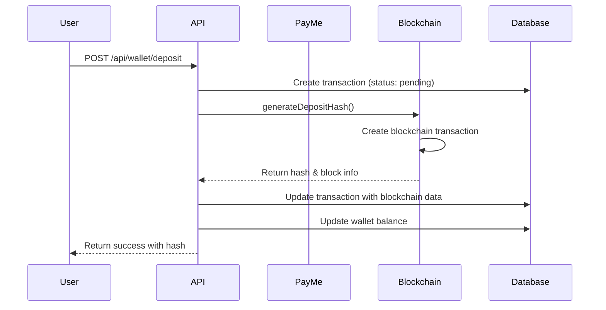
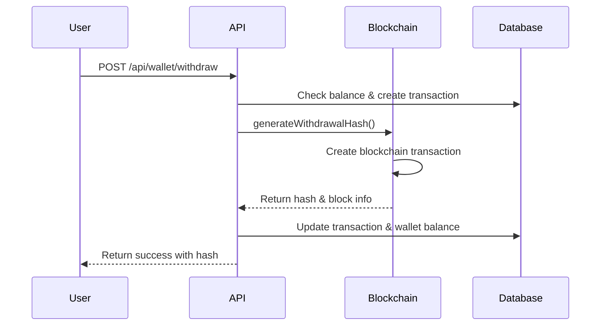
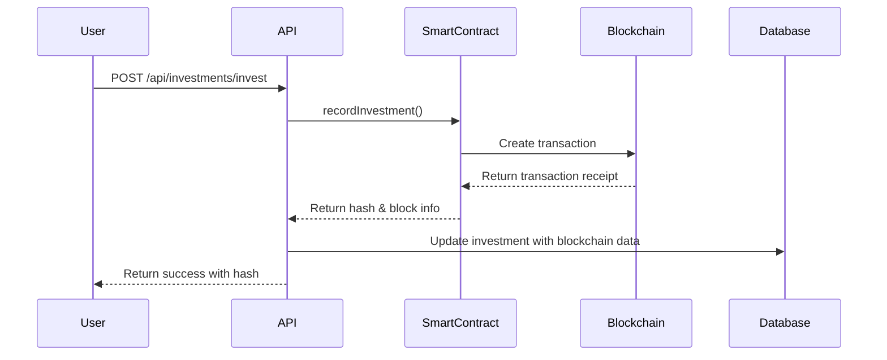

# 🔗 Blockchain Hash Integration Guide

## Overview

This guide documents the comprehensive blockchain integration system that generates cryptographic hashes for all financial transactions (deposits, withdrawals, and investments) in the Korpor platform.

## 🏗️ Architecture

### Core Components

1. **BlockchainService** (`backend/src/services/blockchain.service.js`)
   - Manages blockchain connections (Ethereum, Polygon, Sepolia)
   - Generates transaction hashes for deposits, withdrawals, and investments
   - Provides transaction verification capabilities

2. **Enhanced Transaction Model** (`backend/src/models/Transaction.js`)
   - Added blockchain-specific fields: `blockchainHash`, `blockNumber`, `gasUsed`, `blockchainStatus`, `contractAddress`

3. **Blockchain Routes** (`backend/src/routes/blockchain.routes.js`)
   - API endpoints for blockchain transaction verification and monitoring

4. **Smart Contracts**
   - `InvestmentManager.sol`: Records investment transactions
   - `RentDistributor.sol`: Handles rent distribution logic

## 🔧 Configuration

### Environment Variables

Add these to your `.env` file:

```bash
# Blockchain Configuration (Sepolia Testnet)
ADMIN_WALLET_ADDRESS=0x62ef1b3BD681ec3716dD58A5bB6f6cC16bBFD743
PRIVATE_KEY=your_private_key_here
INFURA_API_KEY=56ef4288fca3409d88a9c8373050639e
INVESTMENT_CONTRACT_ADDRESS=0xC25E147316c1dBD16f5B6427e381f9F4fF9510D6
INFURA_SEPOLIA=https://sepolia.infura.io/v3/56ef4288fca3409d88a9c8373050639e
```

### Network Support

| Network | Chain ID | Currency | Use Case |
|---------|----------|----------|----------|
| Ethereum Mainnet | 1 | ETH | Production |
| Polygon Mainnet | 137 | MATIC | Lower fees |
| Sepolia Testnet | 11155111 | SepoliaETH | Testing |

## 📊 Database Schema Updates

### New Transaction Fields

```sql
ALTER TABLE transactions ADD COLUMN blockchain_hash VARCHAR(66) NULL COMMENT 'Blockchain transaction hash';
ALTER TABLE transactions ADD COLUMN block_number INT NULL COMMENT 'Block number where transaction was mined';
ALTER TABLE transactions ADD COLUMN gas_used VARCHAR(20) NULL COMMENT 'Gas used for blockchain transaction';
ALTER TABLE transactions ADD COLUMN blockchain_status ENUM('pending', 'confirmed', 'failed') NULL COMMENT 'Blockchain transaction status';
ALTER TABLE transactions ADD COLUMN contract_address VARCHAR(42) NULL COMMENT 'Smart contract address if applicable';

-- Add indexes for performance
CREATE INDEX transactions_blockchain_hash_idx ON transactions(blockchain_hash);
CREATE INDEX transactions_blockchain_status_idx ON transactions(blockchain_status);
```

### Migration Command

```bash
cd backend
npx sequelize-cli db:migrate --name add-blockchain-fields-to-transactions
```

## 🚀 API Endpoints

### Blockchain Information

#### GET `/api/blockchain/network-info`
Get current blockchain network information.

**Response:**
```json
{
  "success": true,
  "data": {
    "network": "sepolia",
    "name": "Sepolia Testnet",
    "chainId": 11155111,
    "currency": "SepoliaETH",
    "isTestMode": true,
    "hasWallet": true,
    "contractsLoaded": 2
  }
}
```

### Transaction Verification

#### GET `/api/blockchain/verify-transaction/{hash}`
Verify blockchain transaction status.

**Parameters:**
- `hash`: Blockchain transaction hash

**Response:**
```json
{
  "success": true,
  "data": {
    "hash": "0x1234567890abcdef...",
    "status": "confirmed",
    "confirmations": 12,
    "blockNumber": 18500000,
    "gasUsed": "21000"
  }
}
```

### User Blockchain Transactions

#### GET `/api/blockchain/transactions`
Get user's blockchain transactions with pagination.

**Query Parameters:**
- `page`: Page number (default: 1)
- `limit`: Items per page (default: 20)
- `status`: Filter by blockchain status (pending, confirmed, failed)

**Response:**
```json
{
  "success": true,
  "data": {
    "transactions": [
      {
        "id": 123,
        "type": "deposit",
        "amount": 100.00,
        "currency": "TND",
        "blockchainHash": "0x1234567890abcdef...",
        "blockNumber": 18500000,
        "gasUsed": "21000",
        "blockchainStatus": "confirmed",
        "contractAddress": "0x9876543210fedcba...",
        "createdAt": "2024-01-15T10:30:00Z"
      }
    ],
    "pagination": {
      "total": 50,
      "page": 1,
      "limit": 20,
      "totalPages": 3
    }
  }
}
```

### Manual Sync

#### POST `/api/blockchain/sync-transaction/{id}`
Manually sync transaction status with blockchain.

**Response:**
```json
{
  "success": true,
  "message": "Transaction synced successfully",
  "data": {
    "id": 123,
    "blockchainHash": "0x1234567890abcdef...",
    "oldStatus": "pending",
    "newStatus": "confirmed",
    "confirmations": 12
  }
}
```

## 💰 Transaction Flow

### 1. Deposit Flow



### 2. Withdrawal Flow



### 3. Investment Flow



## 🔍 Hash Generation Methods

### Deposit Hash Generation

```javascript
const blockchainResult = await blockchainService.generateDepositHash({
  userId: 123,
  amount: 100.50,
  currency: "TND",
  walletAddress: "0x742d35Cc6634C0532925a3b844Bc454e4438f44e",
  paymentMethod: "payme",
  transactionId: 456
});

// Returns:
// {
//   hash: "0x1234567890abcdef...",
//   blockNumber: 18500000,
//   gasUsed: "21000",
//   status: "confirmed"
// }
```

### Withdrawal Hash Generation

```javascript
const blockchainResult = await blockchainService.generateWithdrawalHash({
  userId: 123,
  amount: 50.00,
  currency: "TND",
  walletAddress: "0x742d35Cc6634C0532925a3b844Bc454e4438f44e",
  destinationAddress: "external_account",
  transactionId: 789
});
```

### Investment Hash Generation

```javascript
const blockchainResult = await blockchainService.generateInvestmentHash({
  projectId: 1,
  userId: 123,
  userAddress: "0x742d35Cc6634C0532925a3b844Bc454e4438f44e",
  amount: 1000.00,
  currency: "TND"
});
```

## 🛡️ Security Features

### 1. Fallback Mechanism
- If blockchain connection fails, system generates cryptographic mock hashes
- Transactions continue processing to ensure user experience
- Mock hashes are clearly marked with `isMock: true`

### 2. Transaction Verification
- Real-time verification against blockchain networks
- Confirmation counting for transaction finality
- Status synchronization between database and blockchain

### 3. Error Handling
- Graceful degradation when blockchain is unavailable
- Comprehensive logging for debugging
- Retry mechanisms for failed transactions

## 📈 Monitoring & Analytics

### Transaction Status Dashboard

The system provides comprehensive monitoring through:

1. **Network Status**: Real-time blockchain network health
2. **Transaction Metrics**: Success rates, gas usage, confirmation times
3. **Hash Verification**: Automated verification of transaction hashes
4. **Error Tracking**: Failed transactions and retry attempts

### Key Metrics

- **Hash Generation Success Rate**: % of successful hash generations
- **Average Confirmation Time**: Time from submission to confirmation
- **Gas Usage Trends**: Optimization opportunities
- **Network Uptime**: Blockchain network availability

## 🔧 Development & Testing

### Local Development Setup

1. **Install Dependencies**
   ```bash
   cd backend
   npm install ethers
   ```

2. **Configure Environment**
   ```bash
   cp src/env.example .env
   # Edit .env with your blockchain configuration
   ```

3. **Run Database Migration**
   ```bash
   npx sequelize-cli db:migrate
   ```

4. **Start Server**
   ```bash
   npm run dev
   ```

### Testing

#### Unit Tests
```bash
npm test -- --grep "blockchain"
```

#### Integration Tests
```bash
# Test deposit with blockchain hash
curl -X POST http://localhost:5000/api/wallet/deposit \
  -H "Authorization: Bearer YOUR_TOKEN" \
  -H "Content-Type: application/json" \
  -d '{"amount": 100, "description": "Test deposit"}'

# Verify transaction hash
curl http://localhost:5000/api/blockchain/verify-transaction/0x1234567890abcdef...
```

### Mock Mode Testing

For development without blockchain connection:

```bash
NODE_ENV=development npm run dev
```

This enables mock hash generation while maintaining the same API interface.

## 🚀 Production Deployment

### 1. Environment Setup

```bash
# Production environment variables
BLOCKCHAIN_NETWORK=ethereum  # or polygon for lower fees
NODE_ENV=production
BLOCKCHAIN_PRIVATE_KEY=your_production_private_key
ETHEREUM_RPC_URL=https://mainnet.infura.io/v3/YOUR_PRODUCTION_PROJECT_ID
```

### 2. Smart Contract Deployment

Deploy contracts to your chosen network and update environment variables:

```bash
# Deploy InvestmentManager contract
npx hardhat deploy --network ethereum --tags InvestmentManager

# Deploy RentDistributor contract  
npx hardhat deploy --network ethereum --tags RentDistributor
```

### 3. Database Migration

```bash
# Run in production
npx sequelize-cli db:migrate --env production
```

### 4. Monitoring Setup

- Configure blockchain network monitoring
- Set up alerts for failed hash generations
- Monitor gas usage and optimize accordingly

## 🔄 Maintenance

### Regular Tasks

1. **Hash Verification**: Periodic verification of stored hashes
2. **Gas Optimization**: Monitor and optimize gas usage
3. **Network Monitoring**: Track blockchain network health
4. **Database Cleanup**: Archive old blockchain data

### Troubleshooting

#### Common Issues

1. **Hash Generation Fails**
   - Check blockchain network connectivity
   - Verify private key and wallet balance
   - Review gas price settings

2. **Transaction Not Confirmed**
   - Check network congestion
   - Verify gas limit settings
   - Use transaction sync endpoint

3. **Mock Hashes in Production**
   - Verify blockchain configuration
   - Check network connectivity
   - Review error logs

## 📚 Additional Resources

- [Ethers.js Documentation](https://docs.ethers.io/)
- [Ethereum Development Guide](https://ethereum.org/en/developers/)
- [Polygon Network Documentation](https://docs.polygon.technology/)
- [Smart Contract Security Best Practices](https://consensys.github.io/smart-contract-best-practices/)

---

## 🎯 Next Steps

1. **Deploy Smart Contracts**: Deploy to your chosen blockchain network
2. **Configure Environment**: Set up production blockchain configuration
3. **Test Integration**: Thoroughly test all transaction flows
4. **Monitor Performance**: Set up monitoring and alerting
5. **Optimize Gas Usage**: Fine-tune gas settings for cost efficiency

This integration provides a robust, secure, and scalable blockchain hash generation system for all financial transactions in your platform. 